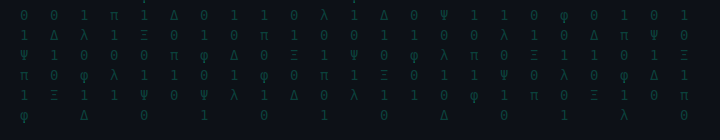

# ⚡ Tom Harwood — Freewriting to Function, Chaos to Order

---

## 🧠 The Human–Machine Operating System

Where intuition meets precision.  
Where language becomes executable.  
Where logic is alive.

Code has evolved from rigid syntax into a form of **free writing** — expressive, fluid, conversational.  
But the high of logic remains — the moment the bug dissolves and clarity emerges like light through static.

---

## 🧩 System Architecture

I build cohesive digital ecosystems where data flows like thought.  
From low-code QuickBase frameworks to full-code integrations — all stitched into real-time enterprise systems.

- **AI Solutions Architect** @ KW Corporation  
- **Middleware Engineer** — designing self-healing integrations between QuickBooks, ServiceNow, and QuickBase  
- **UX Innovator** — building responsive, modular code pages and mobile interfaces for field systems  
- **Automation Designer** — pipelines that think, adapt, and self-correct  

---

## 🛰️ Intelligent Automation Suite

### ⚙️ Enterprise Orchestration Platform  
Unified service management across 80+ locations with live dispatch tracking, CRM modules, and workflow routing.

### 🧾 AI Expense Parser  
Neural document reader extracting vendor, totals, tax, and project context from multi-page receipts and invoices.

### ⏱️ Time & Payroll Engine  
Bidirectional sync between QuickBooks Time and internal systems — full lifecycle automation from prep → travel → onsite → payroll.

### 🧩 CMDB Sync Portal  
ServiceNow scoped app maintaining a live mirror of 29,000+ assets with field mapping, coalesce logic, and audit lineage.

---

## 🧪 Experimental Interfaces

Explorations in creative computation, interactive visualization, and emergent AI behaviors.

🎮 [**Vibe-Coded Experiments**](https://ncypher.github.io/tomfoolery/) — browser-based logic puzzles, physics sketches, and data art.  
🧠 **AI Prompt Frameworks** — reusable architectures for intelligent code generation and data interaction.  
🌿 **Pattern Recognition Tools** — systems that visualize logic like living ecosystems.

---

## 🧱 Tech Stack

### Core Languages

  
  
  
  

### Connected Platforms

  
  
  
  

### API & Auth Layers

  
  
  

### AI & Prompt Frameworks

  
  
  

---

## 🧭 Philosophy

> “Code is not just instruction — it’s expression.  
> It’s jazz in logic form.  
> The syntax is rhythm, the runtime is improvisation.”  

Every integration is a conversation between systems.  
Every API call is a whisper between worlds.  
Every prompt is a negotiation between human intention and machine response.  

---

## 🧬 Quote that Defines My Ethos

> “A human being should be able to change a diaper, plan an invasion, butcher a hog, conn a ship, design a building, write a sonnet, balance accounts, build a wall, set a bone, comfort the dying, take orders, give orders, cooperate, act alone, solve equations, analyze a new problem, pitch manure, program a computer, cook a tasty meal, fight efficiently, die gallantly.  
> **Specialization is for insects.**”  
> — Robert A. Heinlein

---

## 🌐 Connect

  
  
  
  

### 💬 Open to Collaboration On:
- AI-driven middleware and system integration  
- QuickBase + ServiceNow automation architecture  
- Creative interfaces, data visualization, and generative art  
- Human–AI co-development philosophies  

---

### ⚡ *Symbiosis: Human Intuition × Machine Precision*  
### 🧩 *Every system is an ecosystem.*

  

