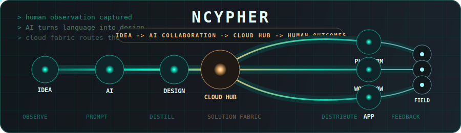

# Tom Harwood / ncypher

**AI solutions architect building practical automation, resilient integrations, and human-centered tools.**

---

## What I Build

I build the connective tissue between people, platforms, and operations.

Most of my work lives where business processes meet software: ServiceNow applications, Quickbase platforms, QuickBooks integrations, Python middleware, JavaScript interfaces, and AI-assisted automation systems.

I enjoy solving the problems that don't fit neatly into diagrams. Real workflows are messy, full of exceptions, workarounds, and human judgment. My goal is to transform that complexity into systems that are easier to trust, easier to maintain, and easier for people to use under pressure.

---

## Current Focus

| Area | Focus |
| --- | --- |
| **Enterprise Orchestration** | Service management, dispatch, CRM, asset tracking, and workflow automation across distributed teams |
| **AI-Assisted Middleware** | OCR, document intelligence, field extraction, validation workflows, and human-in-the-loop automation |
| **Platform Integrations** | Quickbase, ServiceNow, QuickBooks, REST APIs, OAuth, Docker, and cloud-hosted services |
| **Operational UX** | Responsive interfaces, field tools, dashboards, and administrative systems |
| **Developer Systems** | Prompt engineering, coding-agent workflows, debugging frameworks, and automation safety patterns |

---

## Selected Work

### Enterprise Orchestration Platform

Unified service management platform supporting 2,400+ locations with live dispatch tracking, CRM functionality, routing automation, workforce coordination, and operational reporting.

---

### R.E.P.O. — Receipts Extracted, Processed, Organized

An AI-powered document intelligence platform designed to eliminate manual expense processing.

Using OCR and AI-assisted analysis, REPO extracts vendor information, totals, taxes, purchase order numbers, project references, account context, and expense classifications from receipts and invoices. Extracted data is validated against accounting records before entering downstream workflows.

Built for both Quickbase-native deployments and cloud-hosted middleware architectures, REPO supports mobile image capture, desktop workflows, and large-scale PDF processing. During testing, the system successfully processed complex multi-hundred-page vendor invoices while maintaining structured output and reviewability.

The platform reduces manual entry, improves data quality, and creates a searchable expense hierarchy that connects accounting, project management, and operational workflows.

---

### KW Q2Q Integration Platform

Enterprise middleware connecting QuickBooks, QuickBooks Time, AutoTask, Quickbase, GeoTab, ServiceNow, and proprietary internal systems.

The platform automates information flow across the operational lifecycle, including job preparation, travel coordination, onsite work, approvals, payroll processing, inventory management, fleet operations, scheduling, billing, and HR onboarding.

Q2Q functions as a universal translation layer between otherwise disconnected business platforms, enabling consistent workflows across diverse systems and data models.

---

### KWikSync

Certified ServiceNow application that bridges operational field data with ServiceNow's system of record.

KWikSync synchronizes locations, projects, assets, tickets, tasks, warehouse inventory, and field-survey data into unified dashboards and workflows. Through native CMDB integration, organizations gain real-time visibility into operational health and project status.

A dynamic question registry allows survey authors to create and version field assessments without code changes. Configurable health rules classify responses into red, yellow, and green states, transforming raw survey data into actionable findings, remediation tracking, and photo-backed documentation.

---

### KWC Warehouse Management System

Warehouse and inventory management platform integrating CRM, ticketing, accounting, and operational systems.

The application maintains real-time inventory visibility across multiple warehouse facilities, a fleet of more than 40 vehicles, and over 2,400 customer locations. The system supports labor tracking, material billing, inventory movement, replenishment workflows, and operational reporting from a single source of truth.

---

### Early Vibe-Coded Experiments

Before AI-assisted development became mainstream, I used games and browser experiments as a laboratory for prompt design and model evaluation.

These projects were less about game development and more about understanding the capabilities, limitations, and behavioral patterns of emerging language models. Most were intentionally built as "one-shot" experiments to test how far early systems could be pushed with carefully constructed prompts.

Today they serve as a record of that learning process and a snapshot of how rapidly the tooling has evolved.

Explore them here:

**https://ncypher.github.io/tomfoolery/**

Or the library below:
---

## Vibe Lab

Small games and experiments are where I let the human-to-AI workflow stay playful.

| Experiment | Why It Exists |
| --- | --- |
| [Space Invaders Pro](https://ncypher.github.io/tomfoolery/space-invaders-pro.html) | Retro arcade logic with modern JavaScript, particle systems, progression mechanics, and visual polish |
| [3D Rubik's Cube Pro](https://ncypher.github.io/tomfoolery/rubiks-cube-pro.html) | Three.js interaction, lighting systems, camera controls, and spatial interface experimentation |
| [Snake Pro](https://ncypher.github.io/tomfoolery/snake-pro.html) | Classic gameplay rebuilt with smoother animation and modern browser techniques |
| [Cyber Runner](https://ncypher.github.io/tomfoolery/cyber-runner.html) | Side-scrolling timing challenges, obstacle systems, and rapid-play design |
| [Pixel Pet](https://ncypher.github.io/tomfoolery/pixel-pet.html) | State management, interaction loops, and lightweight simulation mechanics |
| [Mandelbrot Lab](https://ncypher.github.io/tomfoolery/mandelbrot-lab.html) | Interactive fractal exploration, zoom systems, color palettes, and mathematical visualization |

---

## Working Style

- AI is a force multiplier, not a substitute for engineering judgment.
- Small, testable changes outperform heroic rewrites.
- Reliability, observability, and auditability matter.
- Good interfaces make complex systems feel calm.
- Prompts, tests, logs, schemas, and UI states are all parts of the same system.
- Automation should amplify human capability, not remove human accountability.

---

## Toolbox

### Languages and Frameworks

  
  
  
  

### Platforms and Infrastructure

  
  
  
  

### APIs and AI Tools

  
  
  
  
  
  

---

## Find Me

  
  
  
  

Open to collaboration on AI-driven middleware, QuickBase and ServiceNow architecture, creative interfaces, data visualization, and human-AI development workflows.

---

## Philosophy

I am fascinated by the space where human creativity and machine capability overlap.

The most interesting systems are not fully automated. They are collaborative. The future is not humans versus AI; it is humans building systems that allow people and machines to solve problems together more effectively than either could alone.

That idea drives nearly everything I build.
