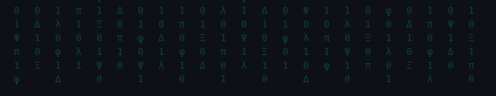

# Tom Harwood / ncypher

**AI solutions architect building practical automation, resilient integrations, and human-centered tools.**

---

## What I Build

I design the connective tissue between people, platforms, and the work that has to get done. Most of my projects live where operations meet software: QuickBase applications, ServiceNow workflows, QuickBooks integrations, Python middleware, JavaScript interfaces, and AI-assisted development systems.

My favorite problems are the ones where the real workflow is messier than the diagram. I like turning that mess into tools that are easier to trust, easier to debug, and easier for humans to use under pressure.

---

## Current Focus

| Area | What It Looks Like |
| --- | --- |
| **Enterprise orchestration** | Service, dispatch, CRM, asset, and workflow systems across distributed teams |
| **AI-assisted middleware** | Receipt parsing, field extraction, data cleanup, and workflow routing with human review points |
| **Platform integrations** | QuickBase, ServiceNow, QuickBooks, REST APIs, OAuth, Dockerized services, and cloud-hosted automations |
| **Operational UX** | Responsive code pages, mobile-friendly field tools, dashboards, and admin interfaces |
| **Developer systems** | Prompt frameworks, coding-agent workflows, reusable debugging patterns, and safer automation loops |

---

## Selected Work

### Enterprise Orchestration Platform

Unified service management across 80+ locations, with live dispatch tracking, CRM modules, routing logic, and operational reporting.

### AI Expense Parser

Document intelligence workflow that extracts vendor, total, tax, project, and account context from receipts and invoices for review and downstream processing.

### Time and Payroll Engine

Bidirectional automation between QuickBooks Time and internal systems, covering job prep, travel, onsite work, approvals, and payroll handoff.

### CMDB Sync Portal

ServiceNow scoped app and integration layer for asset synchronization, field mapping, coalesce logic, and audit-friendly data lineage.

### Vibe-Coded Experiments

Browser-based sketches, games, data visuals, and playful interface studies: [ncypher.github.io/tomfoolery](https://ncypher.github.io/tomfoolery/).

---

## Working Style

- I use AI as a thinking partner, with engineering judgment still at the wheel.
- I prefer small, testable changes over heroic rewrites.
- I care about observability, audit trails, and boringly reliable integrations.
- I like interfaces that make complex systems feel calm and legible.
- I treat prompts, tests, logs, schemas, and UI states as parts of the same system.

---

## Toolbox

### Languages and Frameworks

  
  
  
  

### Platforms and Infrastructure

  
  
  
  

### APIs and AI Tools

  
  
  
  
  
  

---

## Find Me

  
  
  
  

Open to collaboration on AI-driven middleware, QuickBase and ServiceNow architecture, creative interfaces, data visualization, and human-AI development workflows.

