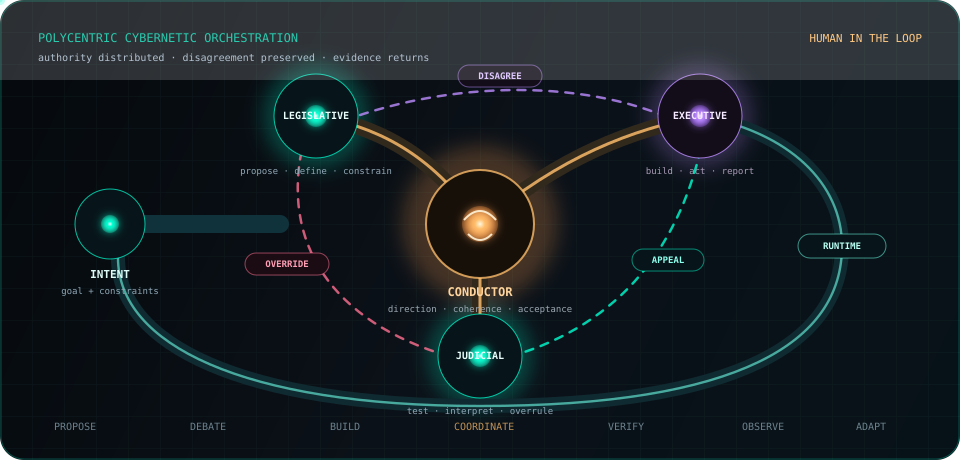

<div align="center">

# Tom Harwood / ncypher

### Designing environments where ideas can evolve into software.

**I work across people, platforms, models, evidence, and code to turn ambiguous intent into systems that can be tested, challenged, and improved.**



[](https://github.com/ncypher)
[](https://x.com/TomHarwood75)
[](https://ncypher.github.io/tomfoolery/)

</div>

---

## What is this place?

This is an active research notebook documenting how ideas become software.

Some entries become code. Some become diagrams, simulations, interfaces, or field notes. Some fail. Some expose contradictions. Some change my mind.

The finished application matters, but the path that produced it matters more.

> **Software is not the only product here. Understanding is. The software is the artifact left behind by the conversation.**

---

## The Work

I build software in the untidy space where real operations meet technology.

My work spans ServiceNow applications, Quickbase systems, Python middleware, JavaScript interfaces, accounting integrations, document intelligence, workflow automation, and multi-model development environments.

The common thread is translation:

> human intent ⇄ shared language ⇄ architecture ⇄ tools and agents ⇄ runtime evidence

**Software increasingly begins as conversation. Source code is no longer always the first formal representation of an idea; it is often the compiled form of an extended dialogue.**

---

## A Cognitive Ecology

I do not use one model as a universal assistant.

I work across an ecosystem of tools with different strengths, failure modes, and roles:

| Tool or environment | Typical role in the ecology |
| --- | --- |
| **ChatGPT** | Exploration, systems thinking, artifact design, synthesis, reframing, and conversational development |
| **Claude** | Prose refinement, critique, alternative reasoning, careful editing, and second-pass review |
| **Gemini** | Google-native workflows, broad exploration, multimodal work, and another independent perspective |
| **NotebookLM** | Source-grounded synthesis, research packets, structured context, and long-form material organized around a corpus |
| **VS Code agents** | Implementation, debugging, iteration, repository work, and runtime-facing development |
| **Grok** | Experimental comparison, edge-case exploration, and deliberately different framing |
| **Image and music generators** | Visual and sonic prototyping, atmosphere, identity, and non-textual forms of thought |
| **Runtime, tests, and users** | Evidence that none of the models can negotiate away |

The interesting question is not **Which model is best?**

It is:

> **How do different tools, perspectives, and forms of evidence help one another notice what any single participant might miss?**

This is less like one assistant and more like a research expedition. Each participant carries different instruments. NotebookLM carries the archive. VS Code carries the tools. Claude edits the field notes. ChatGPT sketches hypotheses on the wall. Gemini brings another map. Grok asks the strange question. Runtime is the weather.

Reality is the mountain.

---

## An Emerging Practice

I am new to cybernetics as a formal tradition, but not to the patterns it describes.

I arrived here through practice: building systems with feedback, watching authority move between people and tools, separating generation from review, preserving disagreement, and learning that a system becomes more trustworthy when it can notice and correct its own errors.

I am not presenting a finished doctrine. I am documenting an emerging practice.

A useful working description is:

### **Conversational cybernetics through distributed judgment**

The system behaves less like a pipeline and more like a knot:

```text
                         constraints
                      ↙       ↓       ↘
intuition ⇄ conversation ⇄ proposal ⇄ implementation
     ↑           ↖          ↕          ↘
     │              disagreement       runtime
     │                 ↕                ↕
     └── revised intent ⇄ review ⇄ evidence
                 ↖          ↓          ↗
                    human acceptance
                         for now
```

The process is iterative, recursive, and sometimes messy.

The builder may challenge the requirement. A critic may be overruled by evidence. A test may invalidate the judge. A minority report may survive when the majority is confidently wrong.

**Disagreement is not treated as failure. It is treated as information.**

---

## Systems in Motion

| System | What It Orchestrates |
| --- | --- |
| **Enterprise Operations Platform** | Dispatch, CRM, routing, workforce coordination, asset tracking, service delivery, and reporting across distributed teams |
| **KWikSync** | Field surveys, locations, assets, tickets, tasks, warehouse operations, photo evidence, remediation, and ServiceNow |
| **Q2Q Integration Platform** | QuickBooks, QuickBooks Time, AutoTask, Quickbase, GeoTab, ServiceNow, and proprietary systems |
| **R.E.P.O.** | Receipts, invoices, OCR, AI extraction, accounting records, validation, and human review |
| **Warehouse Management** | Inventory across facilities, vehicles, customer locations, labor, billing, replenishment, and audit trails |

<details>
<summary><strong>Open the systems notebook</strong></summary>

### KWikSync

A certified ServiceNow application connecting field operations to a system of record. It synchronizes locations, projects, assets, tickets, tasks, inventory, survey responses, remediation requests, evidence, and health-state dashboards.

### R.E.P.O. — Receipts Extracted, Processed, Organized

An AI-assisted document-intelligence system that extracts vendor details, totals, taxes, purchase orders, projects, accounts, and classifications, then subjects the result to validation and review before downstream use.

### Q2Q Integration Platform

Middleware that carries data and state across accounting, time tracking, service management, fleet, inventory, scheduling, payroll, billing, onboarding, and internal operational systems.

### Warehouse Management

A distributed inventory system spanning warehouses, more than 40 vehicles, and thousands of customer locations while connecting materials, labor, tickets, CRM, accounting, and reporting.

</details>

---

## Conversational Artifacts

### Collecting thoughts that wanted to become software.

This began as a collection of browser experiments. It is becoming a living code journal about the changing boundary between language, thought, and software.

Some artifacts began with a carefully shaped prompt. Others moved through ChatGPT, Claude, Gemini, NotebookLM, Grok, editors, browser tools, image generators, music generators, and coding agents.

One system proposed. Another criticized. Another repaired a visual defect or exposed a hidden assumption. Tests and runtime behavior settled arguments that language alone could not.

The result was rarely the product of one model. It was an alloy created through collaboration, disagreement, translation, evidence, and time.

<div align="center">

### A thought → a sketch → an artifact → a field report

### [Enter Conversational Artifacts →](https://ncypher.github.io/tomfoolery/)

</div>

### Rooms in the notebook

- **Field Notes** — observations, contradictions, and things reality taught me
- **Thought Experiments** — interactive ideas about feedback, governance, emergence, and distributed intelligence
- **Living Systems** — gardens, watersheds, neighborhoods, sensors, ecology, and delayed consequences
- **Software Sketches** — small executable ideas with deliberately narrow scope
- **Research Journal** — records of how the process changed my understanding

### Current and emerging artifacts

| Artifact | What It Makes Visible |
| --- | --- |
| **AI Orchestra** | Specialized roles, distributed trust, critique, runtime evidence, and human direction |
| **Feedback Knot** | Nonlinear development, appeals, dissent, reopened questions, and provisional acceptance |
| **Mandelbrot Lab** | Emergence, recursive structure, mathematical exploration, and the limits of direct prediction |
| **The Cognitive Ecology** | Intelligence emerging from relationships among people, tools, evidence, and time |
| **The Vibe-Coded Spaghetti Monster** | Patched-together prototypes, hidden dependencies, accidental architecture, and load-bearing ugliness |
| **Distributed Watershed** | Environmental sensing as a neighborhood-scale nervous system |
| **Cybernetic Garden** | Delayed consequences, adaptive behavior, and feedback made tangible |

The early browser games remain preserved as evidence of the process. They are not the destination. They are the fossil layer.

---

## A Field Note Format

Each artifact can begin with a small record:

```text
Field Note 012

Observation
Programming is becoming a form of exploratory conversation.

Question
What happens if disagreement becomes part of the software instead of something to eliminate?

Artifact
Feedback Knot

Status
Still observing.
```

Not complete.

Not final.

**Still observing.**

---

## Operating Principles

- No single model receives the entire trust circle.
- Generation, criticism, verification, and acceptance remain distinct responsibilities.
- Confidence is not evidence.
- Runtime behavior outranks persuasive explanation.
- Disagreement should remain visible rather than being silently averaged away.
- Some complexity is accidental. Some complexity is historical adaptation.
- Small, observable changes outperform heroic rewrites.
- Good interfaces make complex systems feel calm.
- Automation should expand human capability without dissolving human accountability.

---

## Tools in the Expedition

<div align="center">


</div>

---

## Current Questions

What happens when natural language becomes a genuine development medium?

Can intelligence emerge from the relationships among people, models, tools, evidence, and time rather than residing in any one participant?

How much independent agency can a human coordinate without losing comprehension, accountability, or energy?

Can systems preserve minority reports and productive disagreement instead of manufacturing false consensus?

Can environmental sensing become a distributed nervous system for a neighborhood, watershed, or city?

Can a small interactive artifact teach a systems concept by letting someone feel it before naming it?

---

<div align="center">

### Do not make yourself write. Make yourself wonder.

**What surprised you this week?**  
**What idea refused to leave you alone?**  
**What thought wants to become software?**

[GitHub](https://github.com/ncypher) · [X](https://x.com/TomHarwood75) · [Conversational Artifacts](https://ncypher.github.io/tomfoolery/)


</div>
