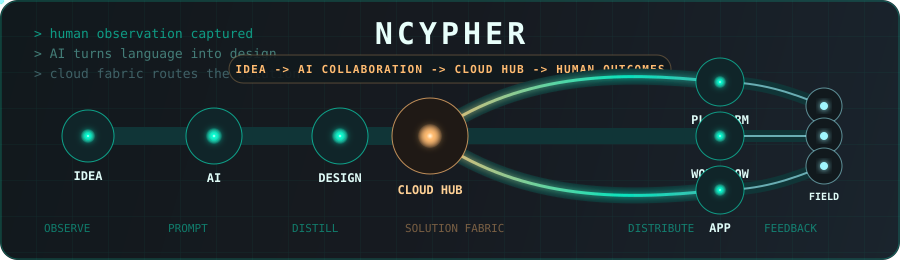

<div align="center">

# Tom Harwood / ncypher

### Programming is becoming a form of exploratory conversation.

**I build the connective tissue between people, platforms, data, and AI.**



[](https://github.com/ncypher)
[](https://x.com/TomHarwood75)
[](https://ncypher.github.io/tomfoolery/)

</div>

---

## What I Do

I design practical software for the untidy space where real operations meet technology.

My work spans ServiceNow applications, Quickbase platforms, Python middleware, JavaScript interfaces, accounting and service-management integrations, AI-assisted document processing, and multi-agent development workflows.

I am especially interested in systems that translate between different forms of information: human intent, business rules, documents, APIs, databases, interfaces, and code.

> **Software increasingly begins as conversation. Source code is no longer always the first formal representation of an idea; it is often the compiled form of an extended dialogue.**

---

## Current Work

| System | What It Connects |
| --- | --- |
| **Enterprise Orchestration** | Dispatch, CRM, service management, routing, workforce coordination, asset tracking, and reporting across distributed operations |
| **KWikSync** | Field surveys, assets, locations, tickets, tasks, warehouse data, evidence, and ServiceNow workflows |
| **Q2Q Integration Platform** | QuickBooks, QuickBooks Time, AutoTask, Quickbase, GeoTab, ServiceNow, and internal systems |
| **R.E.P.O.** | Receipts, invoices, OCR, AI extraction, accounting validation, and review workflows |
| **Warehouse Management** | Inventory movement across warehouses, vehicles, customer locations, labor, billing, and replenishment |

<details>
<summary><strong>More about the systems</strong></summary>

### KWikSync

A certified ServiceNow application that connects field operations to the system of record. It synchronizes locations, projects, assets, tickets, tasks, warehouse inventory, survey responses, remediation requests, photo evidence, and health-state dashboards.

### R.E.P.O. — Receipts Extracted, Processed, Organized

An AI-assisted document-intelligence system for extracting vendor details, totals, taxes, purchase orders, projects, accounts, and classifications from receipts and invoices, then validating the results before they enter downstream workflows.

### Q2Q Integration Platform

Middleware that translates data and workflow state across accounting, time tracking, service management, fleet, inventory, scheduling, billing, payroll, onboarding, and proprietary operational systems.

### Warehouse Management

A distributed inventory system supporting warehouses, more than 40 vehicles, and thousands of customer locations while connecting material movement, labor, tickets, CRM, accounting, and reporting.

</details>

---

## Conversational Artifacts

### Collecting thoughts that wanted to become software.

Before AI-assisted development became an ordinary part of software work, I used small browser applications as a laboratory for natural-language development.

Some began with a carefully shaped prompt. Others passed between GPT, Claude, Gemini, Grok, browser tools, editors, and coding agents. One model might generate; another might critique, restructure, debug, or explain. The finished artifact became an alloy of human direction, multiple model perspectives, testing, and runtime evidence.

The project is now becoming a **living code journal**:

**A thought → a sketch → an artifact**

Small, self-contained experiments exploring feedback, cybernetics, emergence, model orchestration, interfaces, simulations, and the changing relationship between language and software.

<div align="center">

### [Enter Conversational Artifacts →](https://ncypher.github.io/tomfoolery/)

</div>

| Artifact | Exploration |
| --- | --- |
| **AI Orchestra** | Human direction, specialized model roles, review loops, and runtime evidence |
| **Mandelbrot Lab** | Mathematical visualization, navigation, rendering, and emergent structure |
| **Space Invaders** | Game loops, browser rendering, particles, and iterative model refinement |
| **3D Rubik's Cube** | Spatial interaction, Three.js, transforms, lighting, and camera systems |
| **Snake** | State, timing, animation, and responsive interaction |
| **Cyber Runner** | Side-scrolling mechanics, obstacle systems, animation, and pacing |
| **Pixel Pet — Archive** | Persistent browser state and simulation; preserved honestly in its unfinished form |

---

## How I Work

```text
intuition
    ↓
exploratory conversation
    ↓
clarified intent
    ↓
architecture + constraints
    ↓
model generation and critique
    ↓
tests + runtime evidence
    ↓
software
```

- AI is a force multiplier, not a substitute for judgment.
- No single model gets the entire trust circle.
- Generation, criticism, testing, and final acceptance are separate responsibilities.
- Small, observable changes outperform heroic rewrites.
- Good interfaces make complex systems feel calm.
- Automation should amplify human capability without removing human accountability.

---

## Tools I Reach For

<div align="center">


</div>

---

## What I Am Exploring Now

Cybernetics, distributed environmental sensing, feedback systems, human-AI orchestration, agentic software development, operational interfaces, and the possibility that natural language is becoming a genuine development medium.

I am interested in the spaces between established disciplines—the places where an idea can still surprise everyone involved.

---

<div align="center">

### Do not make yourself write. Make yourself wonder.

**What surprised you this week?**  
**What idea refused to leave you alone?**  
**What thought wants to become software?**

[GitHub](https://github.com/ncypher) · [X](https://x.com/TomHarwood75) · [Conversational Artifacts](https://ncypher.github.io/tomfoolery/)


</div>
