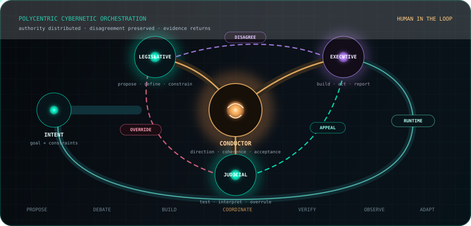

# Tom Harwood / ncypher

### Casting ideas into software.

I build working systems from ambiguous intent — and small worlds that make an idea tangible.

**[About me / Interactive resume](https://ncypher.github.io/tomfoolery/about.html) · [Explore the collection](https://ncypher.github.io/tomfoolery/) · [Enter the Journal Room](https://ncypher.github.io/tomfoolery/journal/) · [Read the philosophy](https://ncypher.github.io/tomfoolery/artifacts/philosophy.html)**

The diagram follows a scored feedback cycle. Click it to introduce dissent, fail a test, and decide when the work is ready.

## Start with something you can touch

Software is one way to think out loud. These experiments let you move a control, disturb a system, and see what answers back.

| Enter an artifact | Follow the question |
| --- | --- |
| [**Polycentric Orchestra**](https://ncypher.github.io/tomfoolery/polycentric-orchestra.html) | What changes when evidence and human acceptance govern the loop? |
| [**Feedback Knot**](https://ncypher.github.io/tomfoolery/feedback-knot.html) | What happens when development doubles back on itself? |
| [**What the Wren Hears**](https://ncypher.github.io/tomfoolery/what-the-wren-hears.html) | Can you understand a radio signal by playing with its shape? |
| [**Crown & Cinder**](https://ncypher.github.io/tomfoolery/crown-and-cinder.html) | What does a decision cost inside a small, competing world? |

**Streamlit worlds:** [Gold Digger](https://gold-digger.streamlit.app) · [Crucible Dynamic](https://crucible-dynamic.streamlit.app) · [Tiny Gods](https://tiny-gods.streamlit.app) · [The Turning](https://the-turning.streamlit.app) · [AI Think Tank](https://ai-think-tank.streamlit.app) · [Synapse](https://synapse-garden.streamlit.app) · [Office Hours](https://office-simulator.streamlit.app/).

**Community work:** [Project reoWren](https://www.patreon.com/cw/ProjectreoWren) explores community-owned reporting and radio-mesh communication. Follow its proof-of-concept development on Patreon.

The early browser games are still here. Their code was entirely generated by the frontier models available when I made them; I supplied prompts, guidance, and testing. I was the crash test dummy. They preserve what those models could make, the questions I was asking, and the revisions that followed.

## The work behind the experiments

I build where real operations meet software: field service, warehouses, accounting, documents, integrations, and the people moving between them.

| System | What it connects |
| --- | --- |
| **KWikSync** | Field operations, locations, assets, tasks, evidence, and ServiceNow |
| **Q2Q** | Accounting, time tracking, service management, fleet, and operational data |
| **R.E.P.O.** | Receipts and invoices, AI extraction, validation, and human review |
| **Warehouse management** | Materials, vehicles, facilities, labor, billing, and inventory history |
| **Enterprise operations** | Dispatch, CRM, routing, workforce coordination, and reporting |

Python · JavaScript · ServiceNow · Quickbase · REST APIs · Docker

[**Meet the person behind the systems →**](https://ncypher.github.io/tomfoolery/about.html) Archaeology, fieldwork, operations, and AI-assisted software: explore the career connecting them.

## How I work

The conversation is often the first draft. An observation becomes a question; the question becomes a sketch; the sketch becomes something we can test.

I work with Claude, Codex, Gemini, NotebookLM, Grok, and tools for images, music, research, and implementation. Roles change with the task. A useful collaborator can propose, build, question, or reveal something the others missed.

The responsibilities stay distinct:

- **Human direction:** purpose, boundaries, taste, and acceptance.
- **Generation and criticism:** make a proposal, expose assumptions, preserve disagreement.
- **Verification:** compare the claim with tests, runtime behavior, and user experience.
- **Revision:** let what happened change what happens next.

Confidence is not evidence. Passing a test does not transfer responsibility to the test. An accepted result can still be reopened when new evidence arrives.

> **Software is not the only product here. Understanding is.**

I am learning the formal language of cybernetics through patterns I first met in practice: feedback, distributed judgment, delayed consequences, and systems that can correct their own mistakes. This is a developing practice, with a notebook to match.

[Philosophy](https://ncypher.github.io/tomfoolery/artifacts/philosophy.html) · [Workflow](https://ncypher.github.io/tomfoolery/artifacts/workflow.html) · [Timeline](https://ncypher.github.io/tomfoolery/artifacts/timeline.html)

## Still observing

**New field notes · September 30, 2026:** [Repo Excavations II — When the Map Has to Answer to the Territory](https://ncypher.github.io/tomfoolery/journal/2026/09-30-repo-excavations.html) follows aging evidence, shared meanings, and Ghost’s archived layers. [I Was the Crash Test Dummy](https://ncypher.github.io/tomfoolery/journal/2026/09-30-crash-test-dummy.html) records what the model-generated games were exploring.

Can a system preserve a useful minority report? Can an interface teach an idea before naming it? Can environmental sensing help a neighborhood notice its own feedback?

The [Journal Room](https://ncypher.github.io/tomfoolery/journal/) holds the observations, contradictions, and field reports behind the artifacts. Entries can remain a paragraph, become software, or change my mind and stop there.

---

### Do not make yourself write. Make yourself wonder.

[About Tom](https://ncypher.github.io/tomfoolery/about.html) · [Conversational Artifacts](https://ncypher.github.io/tomfoolery/) · [GitHub](https://github.com/ncypher) · [X](https://x.com/TomHarwood75)

